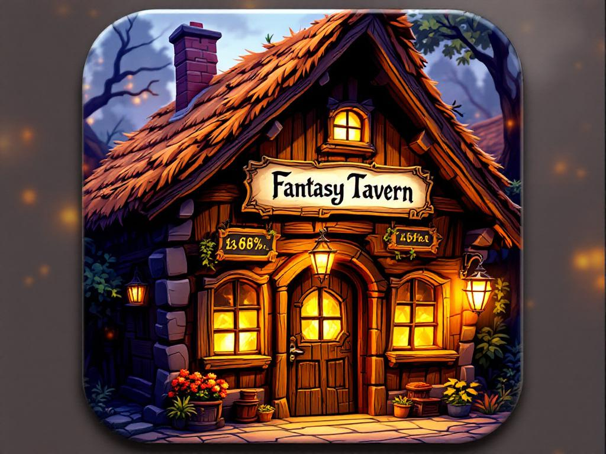

# FantasyTavern

Native macOS app for fantasy worldbuilding. Plain-file storage, wiki-style linking, full-text search, timeline view, image + hex maps, snapshots, markdown + PDF export.



## Features

- **Seven entity types**: characters, locations, lore, items, languages, journal entries, timeline events
- **Wiki-style `[[links]]`** with autocomplete popover + backlinks panel
- **Hybrid markdown editor**: bold/italic/strike/code/headings/lists render inline; markers stay dim-visible
- **⌘K command palette**: fuzzy search + filters (`type:`, `tag:`, `#tag`, `field:value`) + action mode (`>new …`)
- **Schema-driven inspector**: per-entity-type custom fields (string/int/bool/date/enum/ref), tags
- **Per-world schema overrides** via `world.json`
- **Horizontal timeline view**: events on axis w/ era bands, ⌘scroll zoom, Fit-to-events
- **Image maps**: pannable + pinch/⌘scroll zoom, draggable pins, layers w/ visibility toggle
- **Hex grid editor**: pointy-top, paint-with-brush, 8-color default palette
- **Auto-snapshots**: every 10 min if dirty, retention 24h/7d/30d, preview + restore
- **Export**: single entity / type folder / whole world to markdown or PDF
- **FSEvents watcher**: external file edits live-reload sidebar + editor w/ conflict banner
- **Many worlds**: sidebar switcher, Open Recent menu
- **Plain-file portability**: world = folder of `.md` + JSON, editable outside the app

## Requirements

- macOS 14+
- Xcode 26+ (Swift 5.10+)
- [XcodeGen](https://github.com/yonaskolb/XcodeGen) — `brew install xcodegen`

## Build

```bash
git clone https://github.com/Aryza/FantasyTavern.git
cd FantasyTavern
xcodegen generate
open FantasyTavern.xcodeproj
```

Or build from CLI:

```bash
xcodebuild -project FantasyTavern.xcodeproj -scheme FantasyTavernApp -destination 'platform=macOS' build
```

## Test

```bash
swift test --package-path Packages/EntityModel
swift test --package-path Packages/WorldStore
swift test --package-path Packages/WikiLinks
swift test --package-path Packages/SchemaRegistry
swift test --package-path Packages/SearchIndex
swift test --package-path Packages/SnapshotService
xcodebuild -project FantasyTavern.xcodeproj -scheme FantasyTavernApp -destination 'platform=macOS' test
```

~200 tests across the stack.

## World folder layout

```
<world>/
  world.json                   # name, color, calendar.eras, schemaOverrides
  characters/<slug>.md         # YAML front-matter + body
  locations/<slug>.md
  lore/<slug>.md
  items/<slug>.md
  languages/<slug>.md
  journal/<slug>.md
  timeline/<slug>.md
  maps/<name>.{png,jpg,jpeg}
  maps/<name>.json             # { image, layers[{id,name,visible,pins}] }
  hexmaps/<name>.json          # { cols, rows, palette, cells }
  .fantasytavern/
    snapshots/<ISO>.zip
```

Entity file:

```markdown
---
id: lyra-stormwind
type: character
name: Lyra Stormwind
tags: [noble, ranger]
fields:
  race: half-elf
  age: 87
  alignment: NG
created: 2026-05-12T10:00:00Z
updated: 2026-05-12T11:30:00Z
---
Half-elven ranger from [[Silvermoon]]. Member of [[Order of Dawn]].
```

## Project structure

```
FantasyTavern/
  FantasyTavern.xcworkspace       # (optional) Xcode workspace
  project.yml                     # XcodeGen spec
  FantasyTavernApp/
    Sources/                      # SwiftUI app code (Sidebar, Tabs, Editor, Inspector,
                                  #  CommandPalette, Timeline, Map, HexMap, Snapshots, Export)
    Tests/                        # XCTest target
    Assets.xcassets/              # AppIcon
    Info.plist
  Packages/                       # local SPM packages
    EntityModel/                  # value types: Entity, EntityID, EntityType, FieldValue
    WorldStore/                   # disk I/O: front-matter, atomic write, MapStore, HexMapStore, FolderWatcher
    WikiLinks/                    # parser + resolver + backlinks
    SchemaRegistry/               # default schemas + per-world overrides
    SearchIndex/                  # tokenizer + inverted index + query parser + fuzzy scorer
    SnapshotService/              # zip wrappers + retention policy
  docs/superpowers/
    specs/                        # design spec
    plans/                        # implementation plans (1–9 + polish)
```

## Keyboard shortcuts

| Shortcut | Action |
|----------|--------|
| ⌘O | Open World… |
| ⌘N | New Character |
| ⌘K | Command Palette |
| ⌘⇧S | Show Snapshots… |
| ⌘B / ⌘I | Bold / italic (in editor) |
| ↑↓ + ↵ | Navigate + accept autocomplete / palette |
| ⌘↵ | Open palette selection in current tab |
| Esc | Close palette / autocomplete / banner |

## Development

Built plan-by-plan with TDD. Each plan tagged in git:

- `plan-1-foundation-complete` — file-driven core + characters end-to-end
- `plan-1-5-editor-polish-complete` — hybrid markdown + autocomplete + FSEvents
- `plan-2-full-entity-coverage-complete` — all 7 types + schema-driven inspector
- `plan-3-search-palette-complete` — ⌘K palette + search index
- `plan-4-timeline-maps-complete` — horizontal timeline + image maps
- `plan-4-5-timeline-map-polish-complete` — zoom/pan/drag/delete polish
- `plan-5-snapshots-export-complete` — auto-snapshots + markdown export
- `plan-6-polish-complete` — conflict banner + pin labels + snapshot preview
- `plan-7-map-layers-complete` — layered map pins
- `plan-8-hex-grid-complete` — hex grid editor
- `plan-9-pdf-export-complete` — PDF export

See `docs/superpowers/plans/` for full implementation plans.

## License

MIT — see [LICENSE](LICENSE) (if missing, treat as permissive single-author).
